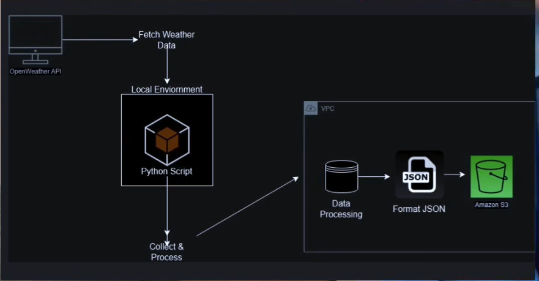

Sure! Here's the updated markdown code with the link to the OpenWeather API Key section added:

```markdown
# Weather Data Collection System 🌤️

**Day 1 Project of the 30-Days DevOps Challenge**

This project is a **Weather Data Collection System** that integrates with the **OpenWeather API** to fetch real-time weather data for multiple cities and stores the data in an AWS S3 bucket. It demonstrates core DevOps principles, such as:

- **Cloud integration** (AWS S3)
- **External API consumption**
- **Error handling**
- **Infrastructure as Code** (IaC) principles
- **Environment variable management**

---

## ✨ Features

- Fetch real-time weather data (temperature, humidity, weather conditions).
- Automatically uploads the data to an **AWS S3** bucket for storage.
- Supports multiple cities.
- Adds timestamps to all data for historical tracking.

---

## 🏗 Architecture

- **Programming Language**: Python 3.x
- **Cloud Provider**: AWS (S3)
- **External API**: OpenWeather API Key

### Dependencies:

- **boto3**: AWS SDK for Python
- **requests**: For API requests
- **python-dotenv**: For managing environment variables

---

## 🛠 Setup Instructions

Follow these steps to set up the Weather Data Collection System:

### 1. Clone the Repository
Clone the repository to your local machine:
```bash
git clone https://github.com/your-username/weather-data-collector.git
cd weather-data-collector
```
## 📸 Screenshot

Here is a screenshot of the Weather Data Collection System in action:



---
### 2. Create a Python Virtual Environment
Create and activate a Python virtual environment:
```bash
python3 -m venv venv
source venv/bin/activate
```

### 3. Install Dependencies
Install the required dependencies:
```bash
pip install -r requirements.txt
```

### 4. Configure the Environment Variables
Create a `.env` file in the root directory with the following content:
```
OPENWEATHER_API_KEY=your_openweather_api_key
AWS_BUCKET_NAME=your_aws_s3_bucket_name
```

#### How to Get Your OpenWeather API Key:
1. Go to the [OpenWeather API Keys page](https://home.openweathermap.org/api_keys).
2. Sign up or log in to your OpenWeather account.
3. Generate your API key from the dashboard.

### 5. Configure AWS CLI
Ensure you have configured **AWS CLI** with proper credentials:
```bash
aws configure
```

### 6. Run the Application
Run the main Python script to fetch and store weather data:
```bash
python src/weather_dashboard.py
```

---

## 🎓 What I Learned

- AWS **S3 bucket** creation and management.
- **Environment variable** management for secure API keys.
- **Python best practices** for API integration.
- **Git workflow** for project development.
- **Error handling** in distributed systems.

---

## 🚀 Future Enhancements

- Add **weather forecasting** features.
- Implement **data visualization** (charts, graphs).
- Support **additional cities** via dynamic input.
- Automate **testing and validation pipelines**.
- Set up a full **CI/CD pipeline**.

---


## License


```

### Key Updates:
- This project is licensed under the **MIT License**..