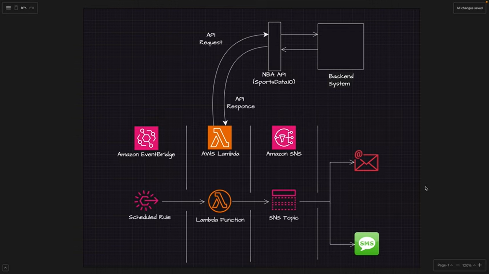

# NBA Game Day Notifications / Sports Alerts System  

## Project Overview  
This project is a cloud-based notification system designed to send real-time NBA game day score updates to subscribed users via SMS or email. It integrates **Amazon SNS**, **AWS Lambda**, **Amazon EventBridge**, and the **NBA APIs** to deliver accurate and timely game information to sports enthusiasts.  

## 📸 Screenshot

Here is a screenshot of the Event-Driven Architecture in action:



---
## Project Structure 
--- 
```
game-day-notifications/  
├── src/  
│   ├── game_day_notification.py # Main Lambda function code  
├── policies/  
├── .gitignore  
└── README.md ## project documenation
```
### Key Contributions  
As part of this project, I:  
1. **Integrated NBA API:** Implemented functionality to fetch live NBA scores using the SportsData.io API.  
2. **Developed Lambda Functionality:** Wrote and deployed the main AWS Lambda function to process API responses and send notifications.  
3. **Configured SNS Topics:** Set up Amazon SNS topics for message distribution and managed subscriptions for email and SMS alerts.  
4. **Automated Scheduling:** Utilized Amazon EventBridge to trigger the Lambda function at regular intervals, ensuring automated updates.  
5. **Followed Best Practices:**  
   - Created IAM roles and policies adhering to the principle of least privilege.  
   - Ensured secure integration between AWS services.  
6. **Deployed Infrastructure:** Configured the notification system using AWS services, ensuring seamless integration of all components.  
7. **Debugging and Testing:** Tested the system rigorously using CloudWatch Logs to monitor function execution and resolve errors.  

---

## Features  
- **Live Score Updates:** Fetches real-time NBA game scores using SportsData.io API.  
- **Multi-Channel Notifications:** Sends SMS and email alerts via Amazon SNS.  
- **Automated Scheduling:** Regular updates using EventBridge rules.  
- **Secure Design:** IAM policies with least privilege for Lambda, SNS, and EventBridge.  

---

## Technical Architecture  
### Technologies Used  
- **Cloud Provider:** AWS  
- **Core Services:** SNS, Lambda, EventBridge  
- **External API:** NBA Game API (SportsData.io)  
- **Programming Language:** Python 3.x  

---

## Setup Instructions  
**Follow the detailed steps in the original project documentation to:**  
- Set up SNS topics and subscriptions.  
- Create and attach IAM policies.  
- Deploy the Lambda function and configure EventBridge automation.  

---

## What I Learned  
- Designing cloud-based notification systems using AWS services.  
- Implementing secure infrastructure with IAM policies.  
- Automating workflows with Amazon EventBridge.  
- Leveraging external APIs to enrich cloud workflows.  
