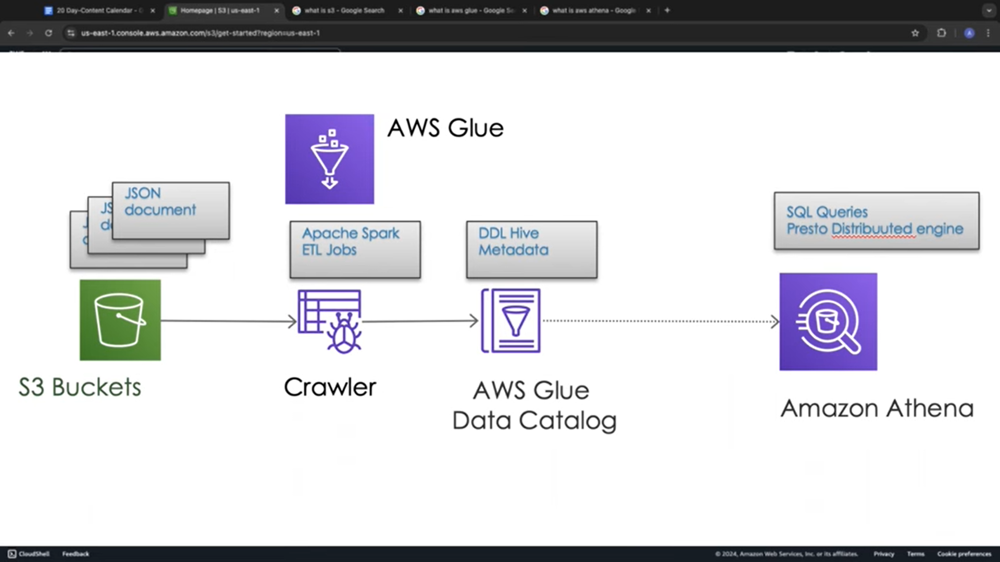

# NBADataLake

This repository contains the `setup_nba_data_lake.py` script, which automates the creation of a data lake for NBA analytics using AWS services. The project integrates **Amazon S3**, **AWS Glue**, and **Amazon Athena** to set up the infrastructure for storing and querying NBA-related data.

---

## 📖 Overview

The `setup_nba_data_lake.py` script performs the following actions:

1. Creates an Amazon S3 bucket to store raw and processed NBA data.
2. Uploads sample NBA data (in JSON format) to the S3 bucket.
3. Configures an AWS Glue database and an external table for querying the data.
4. Enables querying the stored data using Amazon Athena.

---

## 🛠 Prerequisites

Before running the script, ensure the following:

1. **API Access**  
   - Create a free account on [Sportsdata.io](https://sportsdata.io).  
   - Navigate to **Developers > API Resources > Introduction & Testing**.  
   - Sign up for the **SportsDataIO API Free Trial**, selecting **NBA** as the focus area.  
   - Retrieve your API key from the **Query String Parameters** under the "Standings" section.  
---

## 🖼 Screenshot

Here is a screenshot of the setup:



---
2. **AWS IAM Role/Permissions**  
   Ensure your user or role has the following permissions:
   - **Amazon S3**: `s3:CreateBucket`, `s3:PutObject`, `s3:DeleteBucket`, `s3:ListBucket`
   - **AWS Glue**: `glue:CreateDatabase`, `glue:CreateTable`, `glue:DeleteDatabase`, `glue:DeleteTable`
   - **Amazon Athena**: `athena:StartQueryExecution`, `athena:GetQueryResults`

---

## 🚀 Getting Started

### Step 1: Open the AWS CloudShell Console
- Log in to your [AWS account](https://aws.amazon.com).  
- Open **CloudShell** by clicking the terminal icon (square with `>_`) in the top navigation bar.

---

Here is the Markdown code from **Step 2** to **License**:

---

### Step 2: Create the `setup_nba_data_lake.py` File
1. In the CloudShell CLI, type:  
   ```bash
   nano setup_nba_data_lake.py
   ```
2. Copy the content of the `setup_nba_data_lake.py` script from this repository.
3. Paste the content into the CloudShell terminal.
4. Replace the placeholder `api_key` value under [Sportsdata.io configurations] with your API key.
5. Save the file by pressing ^X, then Y, and hit Enter.

---

### Step 3: Create the `.env` File
1. In the CLI, type:
   ```bash
   nano .env
   ```
2. Add the following content, replacing `your_sportsdata_api_key` with your API key:
   ```bash
   SPORTS_DATA_API_KEY=your_sportsdata_api_key
   NBA_ENDPOINT=https://api.sportsdata.io/v3/nba/scores/json/Players
   ```
3. Save the file by pressing ^X, then Y, and hit Enter.

---

### Step 4: Run the Script
1. Execute the script by typing:
   ```bash
   python3 setup_nba_data_lake.py
   ```
2. Verify the output. You should see confirmation of:
   - Resources successfully created.
   - Sample data uploaded successfully.
   - Data Lake Setup completed.

---

### Step 5: Verify Resources
1. Navigate to the **Amazon S3** console:
   - Locate the bucket named `Sports-analytics-data-lake`.
   - Inside the bucket, confirm the presence of:
     - A folder named `raw-data`.
     - A file named `nba_player_data.json` within the `raw-data` folder.
   - Open the file to view the sample NBA data.

2. Navigate to the **AWS Glue** console:
   - Verify that a database named `nba_data_lake_db` has been created.
   - Ensure the `nba_players` table exists in the database.

3. Navigate to **Amazon Athena**:
   - Run the following query to test the setup:
     ```sql
     SELECT FirstName, LastName, Position, Team
     FROM nba_players
     WHERE Position = 'PG';
     ```
   - Verify that the query returns results in the output section of the console.

---

## 🌟 What We Learned

1. How to set up a data lake using AWS services.
2. Automating resource creation with Python scripts.
3. Querying data stored in Amazon S3 using AWS Glue and Amazon Athena.

---

## 🔮 Future Enhancements

1. Automate data ingestion using **AWS Lambda**.
2. Add a data transformation layer with **AWS Glue ETL**.
3. Implement advanced analytics and visualizations using **Amazon QuickSight**.

---

## 🤝 Contributing

Contributions are welcome! To contribute:
1. Fork this repository.
2. Create a feature branch:
   ```bash
   git checkout -b feature-name
   ```
3. Commit your changes:
   ```bash
   git commit -m "Add your message here"
   ```
4. Push to your branch:
   ```bash
   git push origin feature-name
   ```
5. Submit a pull request for review.

---

## 📜 License

This project is licensed under the [MIT License](LICENSE). Feel free to use it in your own projects.
```